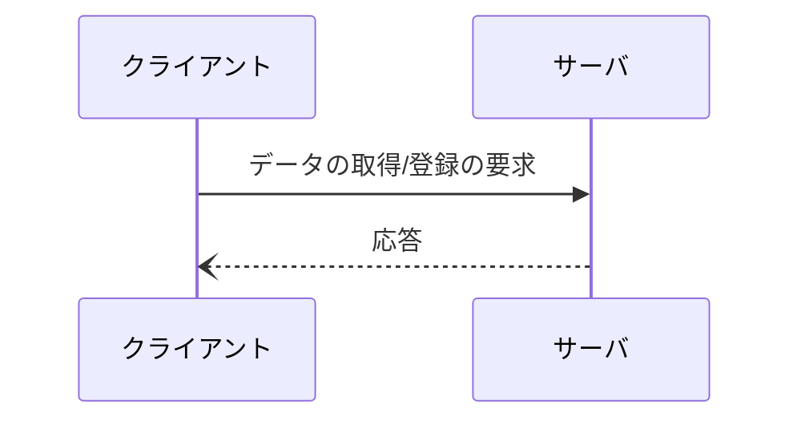
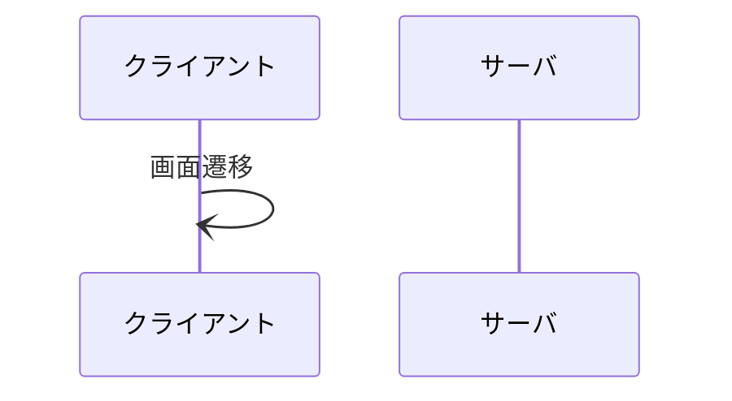
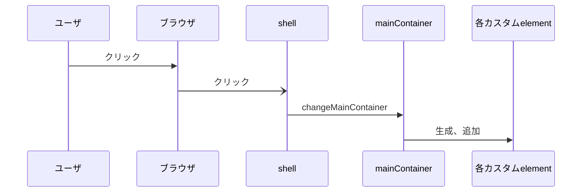
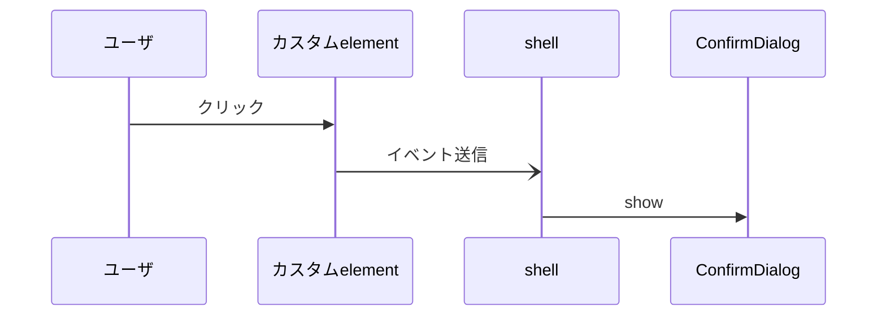

# 教務webアプリ

## アプリの概要

生徒の出欠や成績等のデータを管理し、調査書、指導要録の印刷までを行う。

## アプリの設計
- ホームディレクトリで`npm run docs`して生成される`out/index.html`を参照すること。
これはこのページ及び、ソースコードに記したコメントからjsdocで生成されるドキュメントである。
- (自分へのメッセージ)ソースコードを追加する際には、jsdocの形式のコメントを付けること。
- (自分へのメッセージ)このページに可能な限り設計を書き残すこと。

### 全体構成
- SPA(Single Page webApplication)である。サーバ側では認証、データの保持のみを行い、その他のほとんどの処理はクライアント側で行う。
- 開発に割けるパワーが少なく、メンテナンスし易くするために、可能な限り依存関係を減らしてシンプルな構成を目指している。
- 作りこみすぎない。なるべく素直なHTMLっぽい感じで読めるようにしたい。
- モジュール同士の結合を弱くしておいて、後に追加、変更があった場合に、モジュール内だけを調べて済むようにしたい。
- データの取得/登録(以降、同期は塗り潰し矢印、非同期は塗りつぶさない矢印、応答は点線)

- 画面遷移

### サーバ側
後で書く

### クライアント側
- shellにTitleLine、MainContainerを貼り付けて画面が構成されている。
- MainContainerに追加するカスタムelementを切り替えることをで画面が遷移する。
- 画面遷移はshellが(アンカー(<a ...>)のクリックイベントを奪って行う。

- ブラウザのhistoryを追加することで状態を管理する。
- 登録の確認などを行うダイアログだけは、画面遷移、historyの扱いが他と異なる。

- 登録確認のダイアログはawaitして同期的に処理をし、ブラウザのhistoryは変更しない。
- データ処理の関数はModelに集め、ここでもawaitして同期的に処理を書く。

## アプリのテスト
jestを使う。後で書く。

## アプリの導入
### 導入手順(全体)
準備が必要なのはサーバ側である。以下を行う。
- このリポジトリをcloneする
- `npm install`
- `lib/keys.js`にあるhttpsの鍵を変更
- mongodbにユーザ等のデータを入れる(後述)
- `node app.js`

### 導入手順(データの準備)
後で書く

### バージョン
詳しくはpackage.jsonを見よ。
- node.js : v20
- mongodb : v8
