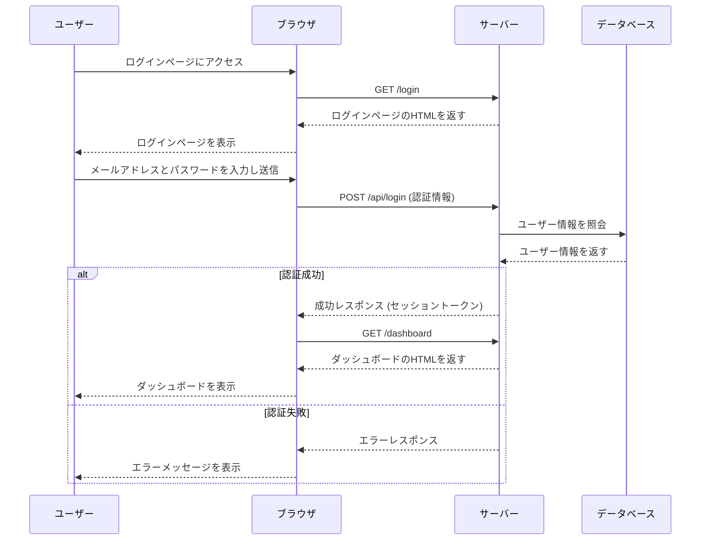
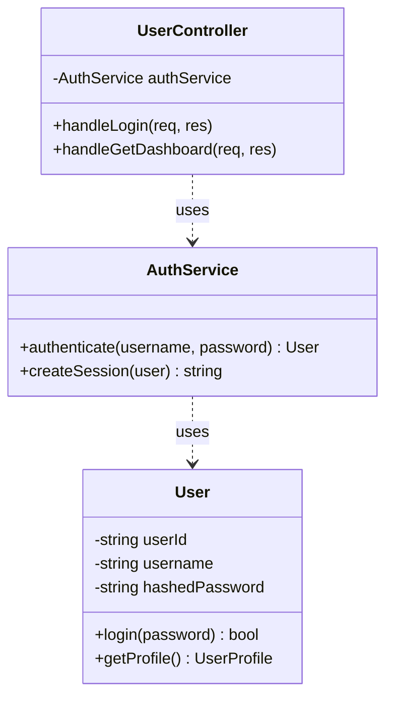
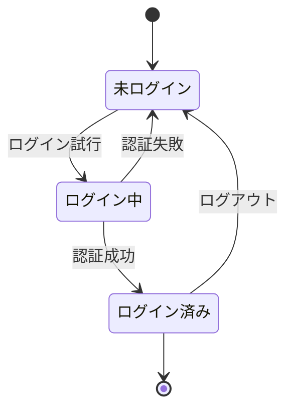

# アプリケーション設計図

## 1. 概要

このドキュメントは、新しいWebアプリケーションの設計について記述したものです。
ユーザー認証機能を持ち、ログイン後にダッシュボードが表示されるシンプルなアプリケーションを想定しています。

## 2. システム構成図

全体の構成を以下に示します。

```mermaid
graph TD
    subgraph "クライアント"
        User[ユーザー] --> Browser[Webブラウザ]
    end

    subgraph "サーバー"
        Browser -- HTTPS --> WebServer[Webサーバー(Node.js/Express)]
        WebServer --> AuthService[認証サービス]
        WebServer --> APIServer[APIサーバー]
        APIServer --> Database[(データベースPostgreSQL)]
    end

    style User fill:#f9f,stroke:#333,stroke-width:2px
    style Browser fill:#ccf,stroke:#333,stroke-width:2px
```

## 3. シーケンス図

### 3.1. ユーザーログイン

ユーザーがログインする際のシーケンス図です。



## 4. クラス図

サーバーサイドの主要なクラス構成です。



## 5. 状態遷移図

ユーザーの状態遷移を示します。


